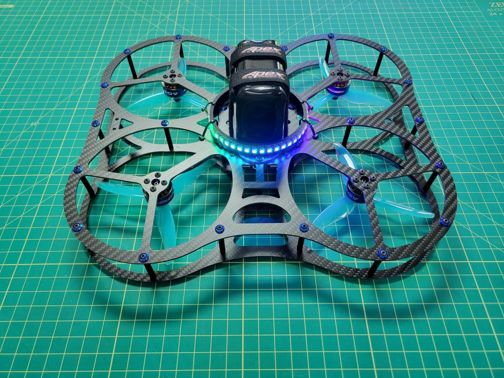
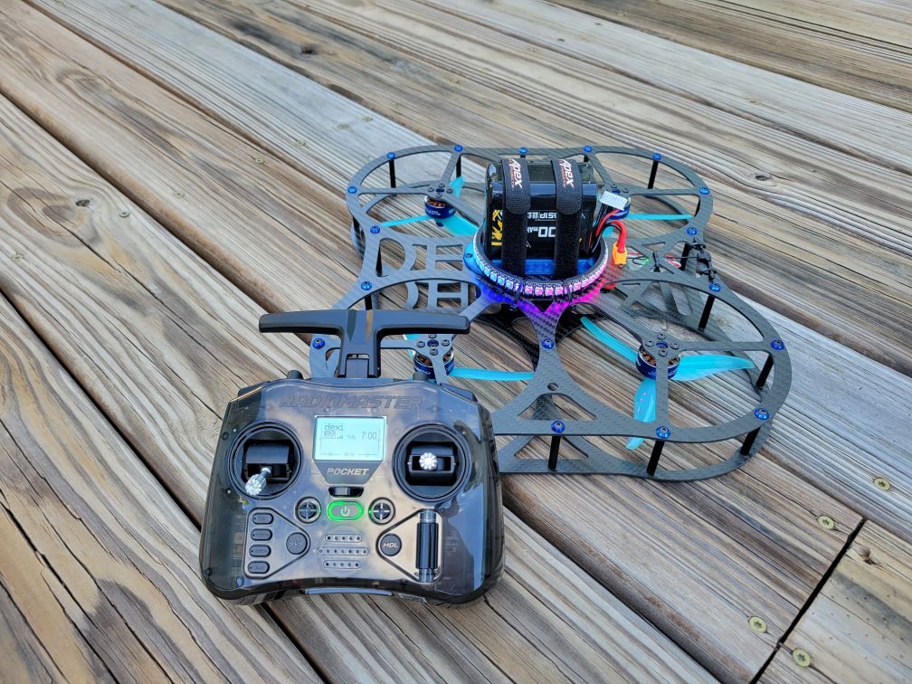

# DroneBlocks DEXI + Pi CM4 + Pixhawk 6X + ARK Flow

Meet DEXI: Drone for Exploration and Innovation. DEXI is a collaboration between DroneBlocks and ARK Electronics with the frame designed by Momentum Drones. If you're looking for the following:

* Long flight times > 15 minutes
* Solderless build
* Programmable
    * DroneBlocks
    * Python
    * C++
    * ROS2
* Raspberry Pi CM4
* LED Ring
* Indoor/outdoor position hold using optical flow
* Cinewhoop style
* Incredibly rugged frame

Then DEXI is your drone.

@[youtube](https://www.youtube.com/watch?v=btGVvurbhD8)

@[youtube](https://youtu.be/AVPEN8K3xWY)

DEXI Assembled | DEXI / RadioMaster Pocket
:-------------------------:|:-------------------------:
 | 

## Key Information

DEXI comes in two flavors:

- **[Solderless Kit Version](https://droneblocks.io/program/dexi-5-px4-stem-drone-kit/)**
    -  The solderless kit version comes with all components pre-soldered and is pretty much plug and play. For example, instead of soldering your motors directly to the ESC we will provide you with MR30 connectors.

- **[Ready to Fly Version](https://droneblocks.io/program/dexi-5-px4-stem-drone-kit/)**
    - The RTF version of the DEXI kit is pre-built at the warehouse, flashed with PX4, calibrated, TX/RX bound, and ready to go. All you need to do is charge your batteries and get ready to fly/code your autonomous missions.

## Kit Hardware

Regardless of which flavor of DEXI you purchase, you will receive all of the components listed below. The difference comes down to whether you decide to build DEXI yourself or order it completely assembled.

### DEXI Frame

Item | Description | Quantity
---|---|---
Top Plate | Carbon fiber (2mm thick) with press nut for TPU battery tray | 1
Bottom Plate | Carbon fiber (2mm thick) with press nut for TPU landing bumper | 1
M3 35mm textured standoffs | Connect top and bottom plates | 24
M3 8mm button head screws | Secure top and bottom plates | 48
M3 6mm button head screws | Motor mounting | 16
M3 8mm button head screws | Mount 4-in-1 ESC to ARK Pi6X Flow FC | 4
M2 16mm textured standoffs | Mount ARK Pi6X Flow FC | 4
M2 8mm button head screws | Mount ARK Pi6X Flow FC | 8
M2 8mm button head screws and nuts | Mount Pi Camera to TPU Housing | 4
M3 button head washers | Use anywhere M3 screw is required | 54

### Electronics
Item | Description | Quantity
---|---|---
ARK Electronics Pi6X Flow FC | Flight controller with compute and optical flow | 1
Raspberry Pi CM4 | Onboard computer running Linux, ROS2, and DroneBlocks | 1
Raspberry Pi Camera v2.1 | Video streaming, photos, fiducial markers | 1 
AOS Supernova Motors | 2207-1980kV |  4
Holybro Tekko32 ESC | F4 4-in-1 50A | 1
RadioMaster RP2 Nano | ExpressLRS Receiver | 1
RadioMaster Pocket | ExpressLRS Transmitter | 1
LED Ring | WS281b LED Strip (44 pixels) | 1

### Wiring
Item | Description | Quantity
---|---|---
ESC to FC | | 1
LED to FC | | 1
RX to FC | | 1

### Accessories
Item | Description | Quantity
---|---|---
Propellers ||
Heatsink ||
Antenna || 
Batteries || 
Battery Straps ||
Battery Charger || 
Voltage Tester || 

### 3D Prints

All DEXI kits come with the following 3D printed parts. [Feel free to download and print your own](https://github.com/DroneBlocks/dexi-3d-prints/tree/main/dexi-5)

Item | Description | Quantity
---|---|---
TPU bottom plate bumpers | Protect DEXI when bumping into objects | 12
TPU center landing bumper | Protect DEXI with rough landings | 1
TPU battery mount | Secure battery to top plate | 1

* 3D Prints
    * 12 x TPU bottom plate bumpers
    * 1 x TPU center landing bumper
    * 1 x TPU battery mount
    * 1 x Pi camera mount
    * 1 x LED ring mount
    * 1 X Receiver mount

Let's get on with the build!

## Assembly

## PX4 Configuration