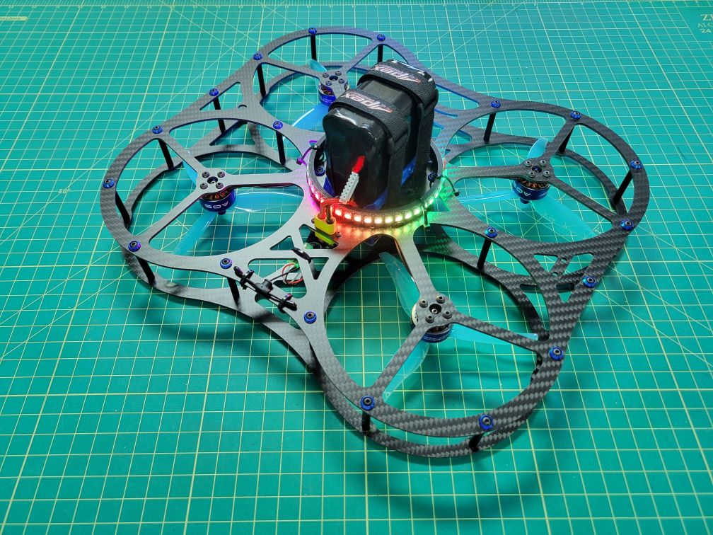

# DroneBlocks DEXI + Pi CM4 + Pixhawk 6X + ARK Flow

Meet DEXI: Drone for Exploration and Innovation. DEXI is a collaboration between DroneBlocks and ARK Electronics with the frame designed by Momentum drones. If you're looking for the following:

@[DEXI position hold outdoors](https://www.youtube.com/watch?v=btGVvurbhD8)

@[DEXI from beneath](https://youtu.be/AVPEN8K3xWY)

- Long flight times > 15 minutes
- Solderless build
- Programmable with DroneBlocks
- LED Ring
- ROS2 Compatible
- Indoor position hold
- Cinewhoop style
- Incredibly rugged frame

Then DEXI is your drone.

DEXI Assembled | DEXI / RadioMaster Pocket
:-------------------------:|:-------------------------:
 | 

## Key Information

DEXI comes in two flavors:

- **Solderless Kit Version**
    -  The solderless kit version comes with all components pre-soldered and is pretty much plug and play. For example, instead of soldering your motors directly to the ESC we will provide you with MR30 connectors.

- **Ready to Fly Version**
    - The RTF version of the DEXI kit is pre-built at the warehouse, flashed with PX4, calibrated, TX/RX bound, and ready to go. All you need to do is charge your batteries and get ready to fly/code your autonomous missions.

## Bill of Materials

* DEXI Frame Kit
    * 1 x Top plate
    * 1 x Bottom plate
    * 24 x M3 35mm textured standoffs (connect between top and bottom plates)
    * 48 x M3 8mm button head screws (to secure top and bottom plates)
    * 16 x M3 6mm button head screws (for motor mounting)
    * 4 x M3 8mm button head screws (for securing 4-in-1 ESC to ARK Pi6X Flow FC)
    * 

* Motors

* 4-in-1 speed controller

The Holybro [X500 V2 Kit](https://holybro.com/collections/x500-kits) includes almost all the required components:

* X500V2 Frame Kit
  * Body - Full Carbon Fiber Top & Bottom plate (144 x 144mm, 2mm thick)
  * Arm - High strength & ultra-lightweight 16mm carbon fiber tubes
  * Landing gear - 16mm & 10mm diameter carbon fiber tubes
  * Platform board - With mounting holes for GPS & popular companion computer
  * Dual 10mm Ø rod x 250 mm long rail mounting system
  * Battery mount with two Battery Strap

## Test 2